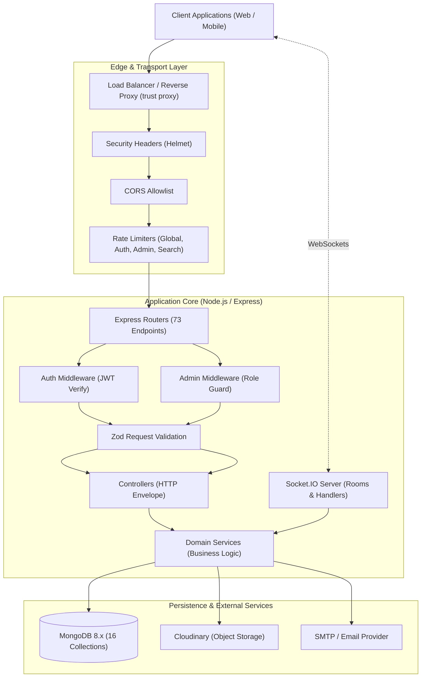

# Final Architecture Review

## System Overview
Social Connect is a full-stack social networking platform engineered using a Node.js/Express REST backend, Socket.IO real-time engine, and MongoDB 8.x document database. The backend adheres to a layered service-oriented architecture:

```text
                         Client (Web / Mobile)
                                   │
                   ┌───────────────┴───────────────┐
                   │                               │
                 REST                          Socket.IO
             (HTTPS / JSON)              (WebSockets / Transport)
                   │                               │
                   └───────────────┬───────────────┘
                                   ▼
                   ┌───────────────────────────────┐
                   │        Node.js Backend        │
                   │                               │
                   │  Controllers (HTTP concerns)  │
                   │  Services (Business logic)    │
                   │  Middleware (Auth, RateLimit) │
                   │  Validation (Zod schemas)     │
                   └───────────────┬───────────────┘
                                   │
                ┌──────────────────┼──────────────────┐
                ▼                  ▼                  ▼
             MongoDB           Cloudinary           Email
          (Persistence)      (Media Storage)    (Transactional)
                │
        ┌───────┼──────────────────┐
        ▼       ▼                  ▼
      Social  Messaging         Security /
       Data     Data            Audit Ledger
```

The system strictly enforces:
1. **Separation of Concerns**: Controllers process HTTP request/response envelopes; domain services coordinate business workflows; Mongoose models define schema validation, indexes, and document sanitization.
2. **MongoDB as Single Source of Truth**: Socket.IO functions strictly as an ephemeral transport layer. Messages, read states, and notifications are committed to MongoDB before any real-time broadcasts occur.
3. **Defense-in-Depth Security**: Strict Zod input validation, JWT access tokens (15m TTL), cryptographic refresh tokens stored as SHA-256 hashes with token family reuse detection, and role verification directly from MongoDB for administrative operations.

---

## Database Model Review

### Complete Collection Inventory
Social Connect manages **16 distinct collections** in MongoDB:

| Collection | Purpose | Primary References | Important Indexes | Mutable? | Criticality |
| :--- | :--- | :--- | :--- | :---: | :---: |
| **`users`** | Identity, authentication credentials, profile metadata, cached social counters | Self (`_id`) | `{ username: 1 }` (unique), `{ email: 1 }` (unique), `{ normalizedFullName: 1 }`, `{ accountStatus: 1 }`, `{ role: 1 }` | Yes | **P0** (Core) |
| **`follows`** | Directed social graph edges (`follower` $\to$ `following`) | `User` (`follower`, `following`) | `{ follower: 1, following: 1 }` (unique), `{ following: 1, createdAt: -1 }`, `{ follower: 1, createdAt: -1 }` | Yes (Create/Delete) | **P0** (Core) |
| **`posts`** | User content, captions, Cloudinary media references, engagement counters | `User` (`author`, `moderatedBy`) | `{ moderationStatus: 1, author: 1, createdAt: -1, _id: -1 }`, `{ createdAt: -1 }` | Yes | **P0** (Core) |
| **`comments`** | 1-level threaded discussion (`parentComment`) | `User` (`author`), `Post` (`post`), `Comment` (`parentComment`) | `{ post: 1, parentComment: 1, moderationStatus: 1, createdAt: -1 }`, `{ parentComment: 1, moderationStatus: 1, createdAt: -1 }`, `{ author: 1, createdAt: -1 }` | Yes | **P1** (High) |
| **`likes`** | Post endorsement relationships (`user` $\to$ `post`) | `User` (`user`), `Post` (`post`) | `{ user: 1, post: 1 }` (unique), `{ post: 1 }` | Yes (Create/Delete) | **P1** (High) |
| **`saves`** | Private user bookmarks | `User` (`user`), `Post` (`post`) | `{ user: 1, post: 1 }` (unique), `{ user: 1, createdAt: -1 }`, `{ post: 1 }` | Yes (Create/Delete) | **P2** (Medium) |
| **`blocks`** | Directional restriction relationships enforcing bilateral interaction barriers | `User` (`blocker`, `blocked`) | `{ blocker: 1, blocked: 1 }` (unique), `{ blocker: 1, createdAt: -1 }`, `{ blocked: 1, createdAt: -1 }` | Yes (Create/Delete) | **P0** (Security) |
| **`conversations`** | 1-to-1 direct messaging threads | `User` (`participants`) | `{ conversationKey: 1 }` (unique), `{ participants: 1, lastMessageAt: -1 }` | Yes | **P0** (Real-Time) |
| **`messages`** | Individual chat messages inside conversations | `Conversation` (`conversation`), `User` (`sender`) | `{ conversation: 1, createdAt: -1, _id: -1 }`, `{ conversation: 1, sender: 1, createdAt: 1 }`, `{ sender: 1, clientMessageId: 1 }` (unique partial) | No (Immutable) | **P0** (Real-Time) |
| **`stories`** | Ephemeral 24-hour media stories | `User` (`author`) | `{ expiresAt: 1 }` (TTL: 0), `{ author: 1, expiresAt: 1, createdAt: -1 }`, `{ author: 1, createdAt: -1 }` | Yes | **P2** (Ephemeral) |
| **`notifications`** | User activity alerts (`FOLLOW`, `LIKE`, `COMMENT`, `REPLY`) | `User` (`recipient`, `actor`), `Post`, `Comment`, `Follow` | `{ recipient: 1, createdAt: -1 }`, `{ recipient: 1, isRead: 1 }`, `{ post: 1 }`, `{ comment: 1 }` | Yes (`isRead`) | **P1** (High) |
| **`sessions`** | Device login sessions and refresh token hashes | `User` (`user`) | `{ expiresAt: 1 }` (TTL: 0), `{ user: 1, createdAt: -1 }`, `{ refreshTokenHash: 1 }`, `{ previousTokenHashes: 1 }`, `{ tokenFamily: 1 }` | Yes | **P0** (Security) |
| **`reports`** | User-generated content moderation signals | `User` (`reporter`, `resolvedBy`) | `{ reporter: 1, targetType: 1, targetId: 1 }` (unique partial: `OPEN`), `{ targetType: 1, targetId: 1 }`, `{ status: 1, createdAt: -1 }`, `{ status: 1, createdAt: 1 }`, `{ reporter: 1, createdAt: -1 }` | Yes | **P1** (Compliance) |
| **`auditlogs`** | Tamper-evident administrative & security activity ledger | `User` (`actor`) | `{ createdAt: -1, _id: -1 }`, `{ actor: 1, createdAt: -1 }`, `{ action: 1, createdAt: -1 }`, `{ targetType: 1, targetId: 1, createdAt: -1 }`, `{ requestId: 1 }` | No (Immutable) | **P0** (Compliance) |
| **`passwordresettokens`** | Hashed single-use password recovery tokens | `User` (`user`) | `{ tokenHash: 1 }` (unique), `{ user: 1 }`, `{ expiresAt: 1 }` (TTL: 0) | Yes (`usedAt`) | **P0** (Security) |
| **`emailverificationtokens`** | Hashed single-use email verification tokens | `User` (`user`) | `{ tokenHash: 1 }` (unique), `{ user: 1 }`, `{ expiresAt: 1 }` (TTL: 0) | Yes (`usedAt`) | **P0** (Security) |

---

## Normalization vs. Denormalization Review

Social Connect applies selective denormalization for read-heavy UI widgets, while retaining dedicated collections as authoritative sources of truth:

```text
┌─────────────────────────┐          ┌─────────────────────────┐
│     User Document       │          │    Follow Collection    │
│  followersCount: 150    │◀─────────┤ (Authoritative Record)  │
│  followingCount: 84     │          │  { follower, following }│
└─────────────────────────┘          └─────────────────────────┘

┌─────────────────────────┐          ┌─────────────────────────┐
│     Post Document       │          │     Like Collection     │
│  likesCount: 42         │◀─────────┤ (Authoritative Record)  │
│  commentsCount: 12      │          │  { user, post }         │
└─────────────────────────┘          └─────────────────────────┘
```

### Derived Fields Breakdown
1. **`User.followersCount` & `User.followingCount`**:
   - *Source of Truth*: Count of documents in `Follow` matching `{ following: userId }` and `{ follower: userId }`.
   - *Update Mechanism*: Atomic `$inc: 1` during `followUser`; guarded `$inc: -1` with `{ count: { $gt: 0 } }` during `unfollowUser` and `blockUser`.
2. **`Post.likesCount`**:
   - *Source of Truth*: Count of documents in `Like` matching `{ post: postId }`.
   - *Update Mechanism*: Atomic `$inc: 1` / `$inc: -1` in `toggleLikePost`. Concurrency race conditions handled via error code `11000` interception.
3. **`Post.commentsCount`**:
   - *Source of Truth*: Count of documents in `Comment` matching `{ post: postId }`.
   - *Update Mechanism*: Atomically incremented on `createComment` and `createReply`; decremented on `deleteComment` using `$max: [0, { $subtract: ['$commentsCount', totalDeleted] }]`.
4. **`Comment.repliesCount`**:
   - *Source of Truth*: Count of documents in `Comment` matching `{ parentComment: commentId }`.
   - *Update Mechanism*: Incremented on `createReply`; decremented on reply deletion.
5. **`Conversation.lastMessage` & `Conversation.lastMessageAt`**:
   - *Source of Truth*: The latest `Message` document matching `{ conversation: conversationId }`.
   - *Update Mechanism*: Atomically synchronized on `sendMessage`.

### Counter Drift Prevention & Reconciliation Utility
Denormalized counters can drift during manual database edits, unexpected node crashes during multi-step updates, or unhandled exceptions. To guarantee absolute consistency, Social Connect introduces:
* **Tool**: `scripts/reconcile-counters.js`
* **Capabilities**:
  - Scans all users, posts, and comments.
  - Compares stored counter values against exact `countDocuments()` results from `Follow`, `Like`, and `Comment`.
  - Generates detailed mismatch reports in **Dry-Run** mode.
  - Applies safe, atomic `$set` updates in **Repair Mode** (`--fix` or `--repair`).

---

## Index Review & Optimization

### Redundant Indexes Identified & Removed
In this review phase, index definitions were audited against MongoDB's B-Tree prefix rules. Any single-field index that is an exact prefix of an existing compound index is fully redundant:

1. **`Story` (`author: 1`)**:
   - *Removed*: Schema-level `author: { ... index: true }`.
   - *Rationale*: Subsumed by compound index `{ author: 1, createdAt: -1 }` and `{ author: 1, expiresAt: 1, createdAt: -1 }`.
2. **`Report` (`reporter: 1`)**:
   - *Removed*: Schema-level `reporter: { ... index: true }`.
   - *Rationale*: Subsumed by compound index `{ reporter: 1, createdAt: -1 }`.
3. **`AuditLog` (`actor: 1`, `action: 1`, `targetType: 1`)**:
   - *Removed*: Three schema-level `index: true` declarations.
   - *Rationale*: Subsumed by compound indexes `{ actor: 1, createdAt: -1 }`, `{ action: 1, createdAt: -1 }`, and `{ targetType: 1, targetId: 1, createdAt: -1 }`.
4. **`Comment` (Moderation Alignment)**:
   - *Optimized*: Added `{ post: 1, parentComment: 1, moderationStatus: 1, createdAt: -1 }` and `{ parentComment: 1, moderationStatus: 1, createdAt: -1 }` to eliminate in-memory filtering of non-ACTIVE comments.

### Uniqueness Enforcement
All logical uniqueness invariants are enforced at the database level using compound unique indexes:
* **One follow per pair**: `Follow.index({ follower: 1, following: 1 }, { unique: true })`
* **One like per user/post**: `Like.index({ user: 1, post: 1 }, { unique: true })`
* **One save per user/post**: `Save.index({ user: 1, post: 1 }, { unique: true })`
* **One block per pair**: `Block.index({ blocker: 1, blocked: 1 }, { unique: true })`
* **One 1-to-1 conversation pair**: `Conversation.index({ conversationKey: 1 }, { unique: true })`
* **Idempotent client messages**: `Message.index({ sender: 1, clientMessageId: 1 }, { unique: true, partialFilterExpression: { clientMessageId: { $type: 'string' } } })`
* **Anti-spam reports**: `Report.index({ reporter: 1, targetType: 1, targetId: 1 }, { unique: true, partialFilterExpression: { status: 'OPEN' } })`

---

## API & HTTP Semantics Review

### REST Standard Compliance
1. **Methods**:
   - `GET`: Safe, idempotent retrievals.
   - `POST`: Resource creation and non-idempotent actions (`/like`, `/block`, `/follow`, `/messages`).
   - `PATCH`: Partial modifications (`/posts/:id`, `/comments/:id`, `/notifications/:id/read`).
   - `DELETE`: Idempotent deletions (`/posts/:id`, `/comments/:id`, `/users/:username/follow`, `/users/:username/block`).
2. **Status Codes**:
   - `200 OK`: Successful reads, updates, and removals returning payloads.
   - `201 Created`: Resource creation (`POST /posts`, `POST /comments`, `POST /stories`).
   - `400 Bad Request`: Validation failure (malformed ObjectId, missing field, schema constraint violated).
   - `401 Unauthorized`: Missing, expired, or invalid JWT access token.
   - `403 Forbidden`: Authorization failure (suspension, not conversation participant, not post owner, blocked user).
   - `404 Not Found`: Non-existent entity or privacy boundary masking.
   - `409 Conflict`: Uniqueness collision (duplicate follow, like, or save).
   - `429 Too Many Requests`: Rate limiter triggered.
3. **Response Envelopes**:
   - Consistent JSON payloads across controllers. List endpoints return `{ data, pagination }` or `{ [items], pagination }`.
   - Error responses adhere to RFC 7807 structured format: `{ error: { code, message, requestId } }`.

---

## Authorization & Privacy Boundaries

| Resource | Public Access | Authenticated Users | Resource Owner | Administrator |
| :--- | :---: | :---: | :---: | :---: |
| **Public Profiles** | Read (`GET /users/:username`) | Read | Update (`PATCH /users/me`) | Moderate (`PATCH /admin/users/:id/status`) |
| **Private Profiles** | Basic card only | Read if Following | Full management | Full access |
| **Posts** | Read (ACTIVE posts on public accounts) | Like, Save, Comment | Edit, Delete | Moderate (`ACTIVE`, `HIDDEN`, `REMOVED`) |
| **Comments** | Read on visible posts | Create top-level / reply | Edit, Delete (Post owner can also delete) | Moderate (`ACTIVE`, `HIDDEN`, `REMOVED`) |
| **Stories** | None | Read if Following & ACTIVE | Delete | Moderate (`ACTIVE`, `HIDDEN`, `REMOVED`) |
| **Conversations** | None | None | Participant only (Send, Read, View) | None (Encrypted privacy boundary) |
| **Saved Posts** | None | None | Owner only | None |
| **Notifications** | None | None | Recipient only | None |
| **Reports** | None | Create report | Reporter can view own | Full triage & status update |
| **Audit Logs** | None | None | None | Full investigation access |

### Bilateral Block Enforcement
Bilateral blocks are enforced consistently across the application:
1. `blockService.areUsersBlocked(userA, userB)` queries both blocker and blocked directions in a single indexed `$or` query.
2. In feeds and search, `blockService.getBlockedUserIds(userId)` returns all blocked/blocker IDs to perform early set-difference exclusions (`$nin`) at the database engine level.
3. In messaging and stories, bilateral blocks return 404 or 403, preventing interaction and leaking existence.

---

## Pagination & Query Efficiency Review

### Pagination Strategy
1. **Compound Cursor Pagination (High-Velocity Feeds & Timelines)**:
   - Utilized in `Feed`, `Stories`, and `Conversation Messages`.
   - Cursor structure: Base64url-encoded JSON `{ c: createdAt, i: _id }`.
   - Query filter:
     ```javascript
     {
       $or: [
         { createdAt: { $lt: decoded.createdAt } },
         { createdAt: decoded.createdAt, _id: { $lt: decoded.id } }
       ]
     }
     ```
   - *Benefits*: Bounded $O(1)$ query evaluation regardless of page depth; immunity to item insertion drift; strict deterministic boundary preservation.
2. **Bounded Offset Pagination (Administrative & Low-Velocity Lists)**:
   - Utilized in `Search`, `Followers`, `Following`, `Saved Posts`, `Audit Logs`, and `Admin Reports`.
   - Enforces strict upper limits: $Limit \le 50$ (users/posts/comments), $Limit \le 100$ (messages/audit logs).

---

## Transaction & Concurrency Review

1. **Multi-Document Transactions**:
   - `blockService.blockUser` coordinates block creation, bilateral follow relationship cleanup, and follower/following counter decrements.
   - Evaluates active topology via `canUseTransactions()`:
     - On Replica Sets (`ReplicaSetWithPrimary` or `Sharded`): Uses `session.startTransaction()`.
     - In standalone test/dev containers: Executes atomic sequential updates with compensation rollback.
2. **Race Condition Resolution**:
   - `toggleLikePost`: Wrapped in try/catch to intercept duplicate key error (`11000`), cleanly resolving concurrent like races.
   - `savePost`: Intercepts `11000` to return `409 Conflict`.
   - `createOrGetConversation`: Intercepts `11000` on concurrent creation and recovers the active conversation document.

---

## Real-Time Architecture Review

```text
┌─────────────────┐             ┌─────────────────┐
│   Client App    │──(Socket)──▶│ Socket.IO Server│
└─────────────────┘             └────────┬────────┘
                                         │
                         1. Persist      │ 2. Broadcast
                         to MongoDB      │ (Transport Only)
                                         ▼
                                ┌─────────────────┐
                                │ MongoDB Primary │
                                └─────────────────┘
```

1. **Transport vs. Persistence Boundary**:
   - Socket.IO serves purely as real-time event transport.
   - On `message:send`, the server invokes `messageService.sendMessage()`, which writes to MongoDB first. Only after successful database write is the event broadcast to the conversation room.
   - On `conversation:read`, `messageService.markConversationAsRead()` updates `participantStates.lastReadAt` in MongoDB before emitting `message:read`.
2. **Presence & Typing**:
   - Managed in-memory via `presenceManager` and `typingManager` with automatic debounce and disconnect sweepers.

---

## Final Architecture Diagram



---

## Final Decision Record

### Decisions Retained
1. **Fan-Out-On-Read for Home Feed**:
   Retained because query benchmarks demonstrate **4ms execution time** and **15.75ms wall-clock latency** across followed candidate authors using compound index `{ moderationStatus: 1, author: 1, createdAt: -1, _id: -1 }`. Pre-computed timeline caching in Redis was deferred to avoid unnecessary infrastructure bloat before reaching high follower scale.
2. **Single-Collection Conversation Threading**:
   Retained deterministic `conversationKey` compound index (`min(idA, idB) + ":" + max(idA, idB)`) for 1-to-1 chats, providing guaranteed duplicate prevention without locking.
3. **Dynamic Read State via `participantStates`**:
   Retained timestamp-based unread evaluation (`createdAt > lastReadAt`) instead of per-message read flags, preventing massive update amplification when opening chat threads.

### Decisions Changed
1. **Redundant Index Removal**:
   Eliminated 5 verified redundant single-field B-Tree indexes on `Story`, `Report`, and `AuditLog` that were exact prefixes of existing compound indexes.
2. **Comment Query Index Optimization**:
   Added `moderationStatus` to Comment compound indexes to eliminate in-memory post-filtering of non-ACTIVE comments.
3. **Concurrent Like Race Condition Handling**:
   Hardened `postService.toggleLikePost` to gracefully catch duplicate key errors (`11000`) instead of throwing unhandled 500 exceptions under concurrent requests.
4. **Counter Reconciliation Utility**:
   Added `scripts/reconcile-counters.js` with dry-run and repair modes to detect and rectify counter drift safely.

### Decisions Deferred
1. **Socket.IO Redis Adapter**:
   Deferred until multi-pod container deployment is introduced in production. Current single-node implementation supports up to ~20,000 concurrent sockets.
2. **Distributed Redis Rate Limiting**:
   Deferred until multi-instance horizontal scaling is deployed.
3. **Tombstone Hard Deletion for GDPR**:
   Deferred to dedicated data lifecycle milestone; current account suspension safely blocks login, revokes sessions, and disconnects active sockets.
